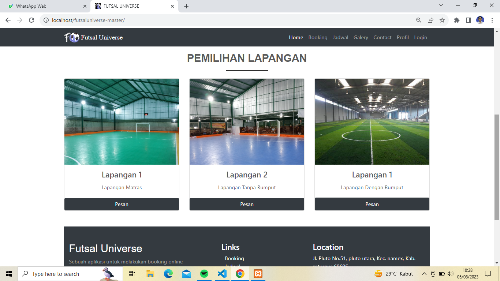
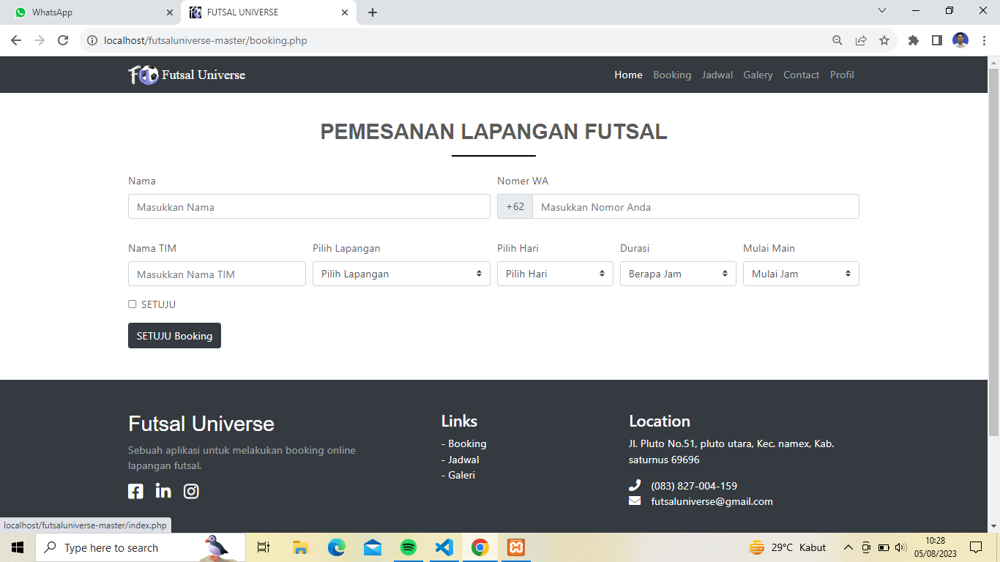
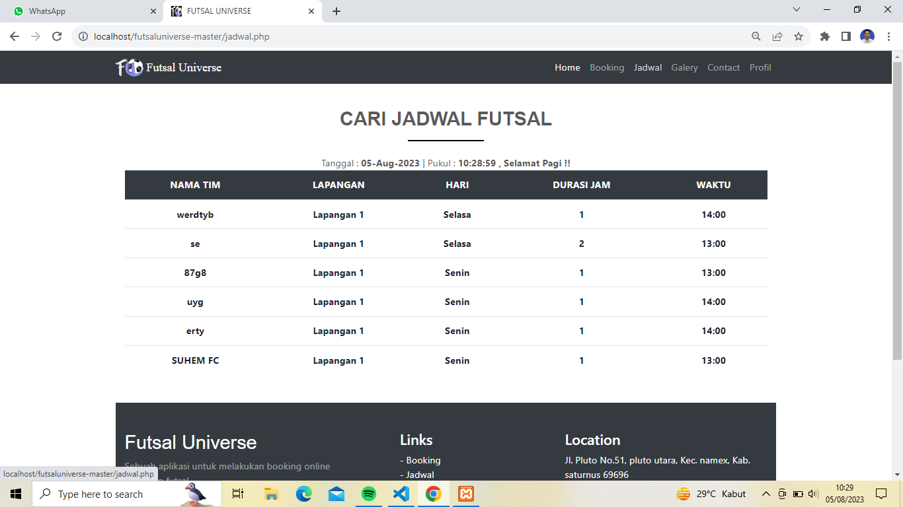

# Futsal Universe - Fauzan

 

## Deskripsi

Futsal Universe adalah aplikasi web yang dirancang untuk membantu para penggemar futsal mencari dan memesan lapangan futsal dengan mudah. Repositori ini berisi kode untuk versi Fauzan dari aplikasi Futsal Universe.

## Fitur

- Cari lapangan futsal berdasarkan lokasi dan filter lainnya.
- Lihat informasi detail tentang lapangan futsal, seperti slot waktu yang tersedia, fasilitas, dan ulasan pengguna.
- Pesan lapangan futsal secara online dengan opsi pembayaran terintegrasi.
- Sistem registrasi dan otentikasi pengguna.
- Sistem ulasan dan penilaian untuk lapangan futsal.
- Dashboard admin untuk mengelola lapangan, pemesanan, dan akun pengguna.

## Teknologi yang Digunakan

- Frontend: HTML, CSS, JavaScript (React.js, Vue.js, atau Angular.js dapat ditambahkan jika digunakan)
- Backend: PHP
- Database: MySQL (atau database lainnya yang kompatibel dengan PHP)

## Instalasi

1. Clone repositori ini: `git clone https://github.com/your_username/futsaluniverse-fauzan.git`
2. Pindah ke direktori proyek: `cd futsaluniverse-fauzan`
3. Pastikan Anda memiliki server web yang mendukung PHP dan database MySQL.
4. Import database ke dalam server MySQL menggunakan file `database.sql` yang disediakan.
5. Jalankan aplikasi dengan mengakses halaman utama melalui server web Anda.

## Tampilan
Halaman home ketika user pertama kali masuk ke website

Halaman pilih lapangan ketika user ingin melihat lapangan-lapangan futsal

Halaman pesan lapangan ketika user ingin memesan lapangan futsal

Halaman cari jadwal ketika user ingin melihat jadwal yang kosong

## Kontribusi

Kami mengundang kontribusi untuk Futsal Universe - Fauzan! Untuk berkontribusi, ikuti langkah-langkah berikut:

1. Fork repositori ini.
2. Buat branch baru: `git checkout -b my-feature-branch`
3. Lakukan perubahan dan commit: `git commit -m "Tambahkan fitur"`
4. Push branch ke repositori: `git push origin my-feature-branch`
5. Buat pull request untuk menjelaskan perubahan yang Anda buat.

## Lisensi

Proyek Futsal Universe - Fauzan dilisensikan di bawah [Lisensi MIT](LICENSE).

## Kontak
...

Kami berharap Anda menemukan proyek ini bermanfaat dan menantikan kontribusi Anda!

---
